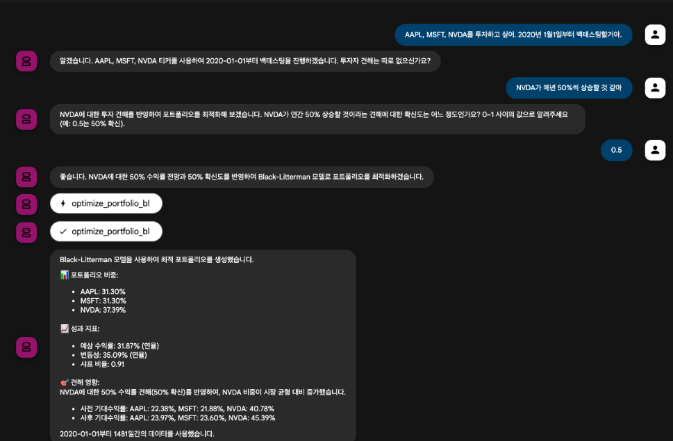

# Black-Litterman Portfolio Optimization MCP Server

이 프로젝트는 **Black-Litterman 포트폴리오 최적화**를 **Model Context Protocol (MCP)** 서버로 제공합니다.

Claude Desktop, Windsurf IDE, Google ADK Agent 등 MCP를 지원하는 모든 AI 에이전트에서 사용할 수 있습니다.

## ✅ 구현 완료 (Phase 1)

- 🎯 **4개 MCP Tools** 구현
- 📊 **PyPortfolioOpt** 통합 (Idzorek 방법 포함)
- 🚀 **FastMCP** 서버 (stdio + HTTP)
- 🧪 **3가지 테스트 방법** (Direct, Agent, Web UI)
- 📦 **자동 데이터 다운로드** (yfinance → Parquet)

---

## 🚀 Quick Start

### 1. 설치

```bash
git clone https://github.com/irresi/bl-view-mcp.git
cd bl-view-mcp
make install
```

### 2. 데이터 다운로드 (자동)

**첫 실행 시 자동으로 다운로드됩니다!** 데이터가 없으면 GitHub Release에서 자동으로 503개 종목 데이터를 다운로드합니다.

**수동 다운로드** (선택):
```bash
# 옵션 A: 사전 패키징된 데이터 (빠름, 503개 종목, 49MB)
make download-data

# 옵션 B: 샘플 데이터만 (3개 종목)
make sample
```

**요구사항**: 옵션 A는 [GitHub CLI](https://cli.github.com/) 필요 (`brew install gh`)

### 3. 테스트

```bash
make test-simple
```

**예상 출력**:
```
✅ Success!
📊 Portfolio Weights:
  AAPL: 33.33%
  MSFT: 33.33%
  GOOGL: 33.33%
```

### 4. 서버 실행

```bash
# HTTP 모드 (ADK Agent, Web UI)
make server-http

# stdio 모드 (Windsurf, Claude Desktop)
make server-stdio
```

📚 **상세 가이드**: [QUICKSTART.md](QUICKSTART.md) | [CONTRIBUTING.md](CONTRIBUTING.md)

---

## 목표

베이지안 통계 모델 기반 포트폴리오 최적화 MCP 서버 구축

- Prior: 시가총액 가중 포트폴리오
- Likelihood: Tool로 제공되는 기대수익률 계산 기능

## 핵심 아이디어

블랙-리터만 모델을 MCP 서버로 구현하여 AI가 포트폴리오 최적화를 수행할 수 있도록 함

- **Prior (사전 분포)**: 시가총액 가중 포트폴리오 - 시장의 균형 상태를 반영
- **Likelihood (우도)**: MCP Tools - 사용자/AI가 투자 견해를 입력하여 포트폴리오 업데이트

---

## 아키텍처

### 전송 방식 (Transport Modes)

FastMCP는 두 가지 전송 방식을 지원하여 다양한 클라이언트와 연동 가능합니다:

#### 1. **stdio 모드** (개발 & 일반 사용)
- **용도**: Claude Desktop, Windsurf, Cline 등 MCP 지원 IDE
- **장점**: 간편한 설정, 빠른 개발/테스트
- **설정**: IDE의 MCP 서버 설정 파일에 등록

```
Tools → FastMCP Server (stdio) → Windsurf/Claude Desktop
```

#### 2. **HTTP 모드** (프로덕션 & 고급 사용)
- **용도**: Google ADK Agent, 웹 서비스 통합
- **장점**: 네트워크 접근, 멀티 클라이언트, 디버깅 용이
- **설정**: HTTP 엔드포인트로 연결

```
Tools → FastMCP Server (HTTP) → ADK Agent (Gemini)
```

---

## MCP Server 구조

### 1. Tools (Likelihood 계산)

#### 1.1 `calculate_expected_returns`

**목적**: 자산의 기대수익률을 계산
**입력**:

- `tickers`: List[str] - 티커 심볼 리스트
- `start_date`: str - 시작 날짜 "YYYY-MM-DD"
- `end_date`: Optional[str] - 종료 날짜 "YYYY-MM-DD" (기본값: 오늘)
- `lookback_days`: Optional[int] - end_date 기준 과거 N일 (start_date와 배타적)
- `method`: str - 계산 방법 ("historical_mean", "capm", "factor_model")
- `data_type`: str - 데이터 타입 ("stock", "etf", "crypto")

**출력**:

```json
{
  "tickers": ["AAPL", "MSFT", "GOOGL"],
  "expected_returns": [0.12, 0.15, 0.10],
  "start_date": "2023-01-01",
  "end_date": "2024-01-01",
  "method": "historical_mean",
  "annualized": true
}
```

#### 1.2 `calculate_covariance_matrix`

**목적**: 자산 간 공분산 행렬 계산
**입력**:

- `tickers`: List[str]
- `start_date`: str - 시작 날짜 "YYYY-MM-DD"
- `end_date`: Optional[str] - 종료 날짜 "YYYY-MM-DD" (기본값: 오늘)
- `lookback_days`: Optional[int] - end_date 기준 과거 N일 (start_date와 배타적)
- `method`: str - ("sample", "ledoit_wolf", "shrinkage")
- `data_type`: str

**출력**:

```json
{
  "tickers": ["AAPL", "MSFT", "GOOGL"],
  "covariance_matrix": [[0.04, 0.02, 0.015], ...],
  "start_date": "2023-01-01",
  "end_date": "2024-01-01",
  "method": "ledoit_wolf",
  "annualized": true
}
```

#### 1.3 `create_investor_view`

**목적**: 투자자 견해(View) 생성 - P 행렬과 Q 벡터 정의
**입력**:

- `portfolio_tickers`: List[str] - 전체 포트폴리오 티커 목록 (P 행렬 크기 결정)
- `view_dict`: Dict[str, float] - 견해 정의 (티커: 계수)
  - 예: `{"AAPL": 1.0, "MSFT": -1.0}` → "AAPL이 MSFT보다 높을 것"
  - 예: `{"TSLA": 1.0}` → "TSLA가 X% 수익률"
- `expected_return`: float - Q 벡터 값 (기대수익률 또는 수익률 차이)
- `confidence`: float - 견해에 대한 확신도 (0~1, Omega 계산에 사용)

**출력**:

```json
{
  "view_id": "view_1",
  "view_type": "relative",
  "P_row": {"AAPL": 1, "MSFT": -1, "GOOGL": 0, "AMZN": 0},
  "Q_value": 0.05,
  "confidence": 0.8,
  "omega": 0.0025,
  "description": "AAPL will outperform MSFT by 5%"
}
```

**사용 예시**:

```python
# 상대적 견해: "AAPL이 MSFT보다 5% 높을 것"
create_investor_view(
    portfolio_tickers=["AAPL", "MSFT", "GOOGL", "AMZN"],
    view_dict={"AAPL": 1.0, "MSFT": -1.0},
    expected_return=0.05,
    confidence=0.8
)

# 절대적 견해: "TSLA가 15% 수익률"
create_investor_view(
    portfolio_tickers=["AAPL", "MSFT", "GOOGL", "AMZN", "TSLA"],
    view_dict={"TSLA": 1.0},
    expected_return=0.15,
    confidence=0.6
)
```

#### 1.4 `optimize_portfolio_bl`

**목적**: 블랙-리터만 모델로 최적 포트폴리오 계산
**입력**:

- `tickers`: List[str]
- `expected_returns`: Dict[str, float] - Tool 1.1의 출력 (티커별 기대수익률)
- `covariance_matrix`: Dict[str, Dict[str, float]] - Tool 1.2의 출력
- `views`: List[Dict] - Tool 1.3으로 생성한 견해들 (선택사항, 빈 리스트 가능)
- `prior_type`: str - "market_cap", "equal_weight", "hrp", "custom" (기본값: "market_cap")
- `prior_weights`: Optional[Dict[str, float]] - prior_type이 "custom"인 경우 필요
- `risk_aversion`: float - 위험 회피 계수 (기본값: 2.5)
- `tau`: float - 불확실성 계수 (기본값: 0.025)
- `data_type`: str

**출력**:

```json
{
  "tickers": ["AAPL", "MSFT", "GOOGL"],
  "prior_weights": [0.4, 0.35, 0.25],
  "posterior_weights": [0.45, 0.30, 0.25],
  "expected_returns": [0.12, 0.10, 0.11],
  "portfolio_return": 0.115,
  "portfolio_volatility": 0.18,
  "sharpe_ratio": 0.64
}
```

#### 1.5 `backtest_portfolio`

**목적**: 포트폴리오 백테스팅
**입력**:

- `weights`: Dict[str, float] - 티커별 가중치
- `start_date`: str - "YYYY-MM-DD"
- `end_date`: str
- `rebalance_frequency`: str - "monthly", "quarterly", "yearly"
- `benchmark`: str - "SPY", "QQQ", "^KOSPI"
- `data_type`: str

**출력**:

```json
{
  "returns": {
    "total_return": 0.45,
    "annualized_return": 0.12,
    "cagr": 0.115
  },
  "risk": {
    "volatility": 0.18,
    "max_drawdown": -0.15,
    "downside_deviation": 0.12,
    "var_95": -0.025,
    "cvar_95": -0.032
  },
  "risk_adjusted": {
    "sharpe_ratio": 0.67,
    "sortino_ratio": 0.85,
    "calmar_ratio": 0.80,
    "information_ratio": 0.45
  },
  "benchmark_comparison": {
    "benchmark_return": 0.38,
    "alpha": 0.07,
    "beta": 0.95,
    "tracking_error": 0.05,
    "active_return": 0.07
  },
  "additional": {
    "win_rate": 0.58,
    "avg_win": 0.025,
    "avg_loss": -0.018,
    "profit_factor": 1.45,
    "recovery_factor": 3.0
  },
  "time_series": {
    "cumulative_returns": [...],
    "dates": [...]
  }
}
```

#### 1.6 `get_market_data`

**목적**: 시장 데이터 조회 (가격, 거래량, 펀더멘탈)
**입력**:

- `tickers`: List[str]
- `start_date`: str - 시작 날짜 "YYYY-MM-DD"
- `end_date`: Optional[str] - 종료 날짜 "YYYY-MM-DD" (기본값: 오늘)
- `lookback_days`: Optional[int] - end_date 기준 과거 N일 (start_date와 배타적)
- `data_type`: str - 데이터 타입 ("stock", "etf", "crypto")
- `fields`: List[str] - 조회할 필드 ["Close", "Volume", "market_cap", "sector", "pe_ratio"]

**출력**:

```json
{
  "AAPL": {
    "prices": {
      "2023-01-01": 178.50,
      "2023-01-02": 179.20,
      ...
    },
    "fundamentals": {
      "market_cap": 2800000000000,
      "sector": "Technology",
      "pe_ratio": 29.5,
      "dividend_yield": 0.0052
    },
    "statistics": {
      "52_week_high": 198.23,
      "52_week_low": 164.08,
      "avg_volume": 58000000
    }
  },
  ...
}
```

#### 1.7 `calculate_factor_scores`

**목적**: 팩터 기반 종목 스코어링 (주식 전용)
**입력**:

- `tickers`: List[str]
- `start_date`: str - 시작 날짜 "YYYY-MM-DD"
- `end_date`: Optional[str] - 종료 날짜 "YYYY-MM-DD" (기본값: 오늘)
- `lookback_days`: Optional[int] - end_date 기준 과거 N일 (start_date와 배타적)
- `factors`: List[str] - ["value", "growth", "momentum", "quality", "size"]
- `factor_weights`: Optional[Dict[str, float]] - 팩터별 가중치 (기본값: 균등)

**출력**:

```json
{
  "AAPL": {
    "composite_score": 0.75,
    "value_score": 0.6,
    "growth_score": 0.9,
    "momentum_score": 0.8,
    "quality_score": 0.95,
    "rank": 15,
    "calculation_period": {
      "start_date": "2023-01-01",
      "end_date": "2024-01-01"
    }
  },
  ...
}
```

#### 1.8 `calculate_hrp_weights`

**목적**: 계층적 위험 분산(HRP) 가중치 계산
**입력**:

- `tickers`: List[str]
- `start_date`: str - 시작 날짜 "YYYY-MM-DD"
- `end_date`: Optional[str] - 종료 날짜 "YYYY-MM-DD" (기본값: 오늘)
- `lookback_days`: Optional[int] - end_date 기준 과거 N일 (start_date와 배타적)
- `data_type`: str

**출력**:

```json
{
  "tickers": ["AAPL", "MSFT", "GOOGL"],
  "weights": [0.35, 0.40, 0.25],
  "start_date": "2023-01-01",
  "end_date": "2024-01-01",
  "method": "hrp",
  "diversification_ratio": 1.45
}
```

---

### 2. Resources (데이터 접근)

#### 2.1 `portfolio://current`

현재 최적화된 포트폴리오 정보

#### 2.2 `data://prices/{ticker}`

특정 티커의 가격 데이터

#### 2.3 `data://factors/{ticker}`

특정 티커의 팩터 데이터

#### 2.4 `views://saved`

저장된 투자자 견해 목록

---

### 3. Prompts (사용 예시)

#### 3.1 "Optimize my portfolio"

```
I want to optimize a portfolio with these stocks: AAPL, MSFT, GOOGL, AMZN.
Use market cap weighted prior and I believe tech stocks will outperform by 5% this year.
```

#### 3.2 "Backtest strategy"

```
Backtest a portfolio with equal weights on SPY, QQQ, IWM from 2020-01-01 to 2024-01-01.
Rebalance quarterly.
```

---

## 프로젝트 구조

├── pyproject.toml              # 프로젝트 설정 및 의존성
├── README.md
├── .env.example                # 환경 변수 템플릿
├── bl_mcp/                     # MCP 서버 패키지
│   ├── __init__.py
│   ├── server.py               # FastMCP 서버 정의 (@mcp.tool)
│   ├── tools.py                # 핵심 로직 (PyPortfolioOpt 래퍼)
│   └── utils/
│       ├── __init__.py
│       ├── data_loader.py      # Parquet → DataFrame
│       └── validators.py       # 입력 검증 및 에러 처리
├── bl_agent/                   # ADK Agent 패키지 (선택사항)
│   ├── __init__.py
│   ├── agent.py                # Google ADK Agent 정의
│   └── prompt.py               # Agent 프롬프트
├── start_stdio.py              # stdio 모드 실행 (Windsurf용)
├── start_http.py               # HTTP 모드 실행 (ADK Agent용)
├── tests/
│   ├── test_tools.py
│   └── test_integration.py
└── data/                       # Parquet 데이터 저장소
    └── ...
```

---

## 구현 단계

### Phase 1: MCP 서버 MVP (Black-Litterman Core)

**목표**: FastMCP를 사용하여 핵심 라이브러리(**`PyPortfolioOpt`**)를 AI가 사용할 수 있도록 MCP Tools로 노출합니다.

- [X] **데이터 수집 파이프라인** ✅
  - [X] `scripts/download_data.py` - 개별 종목 다운로드 (yfinance → Parquet)
  - [X] `scripts/download_sp500.py` - S&P 500 전체 다운로드 (503개 종목)
  - [X] `bl_mcp/utils/session.py` - HTTP 세션 관리 (랜덤 User-Agent, Retry)
  
  **사용법**:
  ```bash
  # 개별 종목 다운로드
  uv run python scripts/download_data.py AAPL MSFT GOOGL --start 2023-01-01
  
  # S&P 500 전체 다운로드 (상장일부터 전체 히스토리)
  uv run python scripts/download_sp500.py
  
  # 일부만 테스트
  uv run python scripts/download_sp500.py --limit 10
  ```

- [ ] **프로젝트 설정**
  - [ ] `pyproject.toml` 작성
    ```toml
    [project]
    name = "black-litterman-mcp"
    version = "0.1.0"
    requires-python = ">=3.11"
    dependencies = [
        "fastmcp==2.13.0.1",
        "PyPortfolioOpt>=1.5.5",
        "pandas>=2.0.0",
        "numpy>=1.24.0",
        "yfinance>=0.2.0",
        "python-dotenv>=1.0.0",
    ]
    
    [project.optional-dependencies]
    agent = [
        "google-adk[a2a]==1.14.1",
        "google-genai>=1.38.0",
    ]
    ```
  - [ ] 패키지 구조 생성 (`bl_mcp/`, `bl_agent/`)
  - [ ] 의존성 설치: `uv sync` 또는 `pip install -e .`

- [ ] **데이터 로더 구현** (`bl_mcp/utils/data_loader.py`)
  - [ ] Parquet 파일 읽기 함수
  - [ ] 날짜 범위 필터링
  - [ ] 결측치 처리
  - [ ] 수익률 계산 유틸리티

- [ ] **입력 검증 구현** (`bl_mcp/utils/validators.py`)
  - [ ] 티커 유효성 검증
  - [ ] 날짜 범위 검증 (start_date <= end_date)
  - [ ] 데이터 충분성 검증 (최소 데이터 포인트)
  - [ ] 공분산 행렬 singular 체크
  - [ ] 최적화 파라미터 검증

- [ ] **핵심 Tools 로직 구현** (`bl_mcp/tools.py`)
  
  각 함수는 순수 Python 로직으로 구현하며, `Dict[str, Any]` 형식으로 결과를 반환합니다.
  
  - [ ] **Tool 1.1**: `calculate_expected_returns`
    - 라이브러리: `PyPortfolioOpt.expected_returns`
    - 지원 방법: `mean_historical_return`, `ema_historical_return`, `capm_return`
    - 입력: tickers, start_date, end_date, lookback_days, method
    - 출력: `{"success": True, "tickers": [...], "expected_returns": {...}, ...}`
  
  - [ ] **Tool 1.2**: `calculate_covariance_matrix`
    - 라이브러리: `PyPortfolioOpt.risk_models`
    - 지원 방법: `sample_cov`, `ledoit_wolf`, `exp_cov`, `semicovariance`
    - 입력: tickers, start_date, end_date, lookback_days, method
    - 출력: `{"success": True, "covariance_matrix": {...}, ...}`
  
  - [ ] **Tool 1.3**: `create_investor_view`
    - 자체 구현 (view_dict → P, Q, Omega 변환 래퍼)
    - Omega 계산: confidence 기반 자동 계산 (omega = (1 - confidence) * variance)
    - 입력: portfolio_tickers, view_dict, expected_return, confidence
    - 출력: `{"success": True, "view_id": "...", "P_row": {...}, "Q_value": ..., ...}`
  
  - [ ] **Tool 1.4**: `optimize_portfolio_bl`
    - 라이브러리: `PyPortfolioOpt.black_litterman.BlackLittermanModel`
    - **중요**: Tool 1.1, 1.2의 출력을 입력으로 받음 (모듈형 설계)
    - Prior 계산: market_cap weighted (시가총액 기반)
    - 제약 조건: long_only, max_weight 지원
    - 입력: tickers, expected_returns, covariance_matrix, views, prior_type, risk_aversion, tau
    - 출력: `{"success": True, "posterior_weights": {...}, "portfolio_return": ..., ...}`

- [ ] **FastMCP 서버 구현** (`bl_mcp/server.py`)
  
  FastMCP의 `@mcp.tool` 데코레이터를 사용하여 tools.py의 함수를 MCP Tools로 노출합니다.
  
  ```python
  from fastmcp import FastMCP
  from . import tools
  
  mcp = FastMCP("black-litterman-portfolio")
  
  @mcp.tool
  def calculate_expected_returns(
      tickers: list[str],
      start_date: str,
      end_date: str | None = None,
      lookback_days: int | None = None,
      method: str = "historical_mean",
      data_type: str = "stock"
  ) -> dict:
      """
      Calculate expected returns for assets.
      
      Args:
          tickers: List of ticker symbols
          start_date: Start date in 'YYYY-MM-DD' format
          end_date: End date (default: today)
          lookback_days: Lookback period (mutually exclusive with start_date)
          method: Calculation method ('historical_mean', 'capm', etc.)
          data_type: Data type ('stock', 'etf', 'crypto')
      
      Returns:
          Dictionary with expected returns
      """
      return tools.calculate_expected_returns(
          tickers, start_date, end_date, lookback_days, method, data_type
      )
  
  # Tool 1.2, 1.3, 1.4도 동일한 패턴으로 구현
  ```

- [ ] **실행 스크립트 작성**
  
  - [ ] `start_stdio.py` (Windsurf/Claude Desktop용)
    ```python
    from bl_mcp.server import mcp
    
    if __name__ == "__main__":
        mcp.run(transport="stdio")
    ```
  
  - [ ] `start_http.py` (ADK Agent용)
    ```python
    from bl_mcp.server import mcp
    
    if __name__ == "__main__":
        mcp.run(transport="http", host="localhost", port=5000)
    ```

- [ ] **Windsurf MCP 설정**
  
  `.windsurf/mcp_config.json` 또는 Windsurf 설정에 추가:
  ```json
  {
    "mcpServers": {
      "black-litterman": {
        "command": "python",
        "args": ["/absolute/path/to/start_stdio.py"],
        "env": {}
      }
    }
  }
  ```

- [ ] **기본 테스트** (stdio 모드)
  - [ ] MCP 서버 등록 확인
  - [ ] Windsurf에서 Tools 목록 확인
  - [ ] **시나리오 1: 기본 포트폴리오 최적화** 실행
  - [ ] 결과 검증 및 디버깅

---

### Phase 2: 기능 확장 (백테스팅 및 전략 다각화)

**목표**: 백테스팅 기능을 추가하여 전략을 검증하고, HRP 및 팩터 모델을 통합하여 Prior와 Likelihood를 다양화합니다.

- [ ] **백테스팅 Tool 구현**

  - [ ] **Tool 1.5**: `backtest_portfolio`
    - 백테스팅 엔진: **`VectorBT`** (포트폴리오 리밸런싱 지원) 또는 **직접 구현**
      - VectorBT: 다중 자산 포트폴리오에 최적화, 리밸런싱 내장
      - 직접 구현: 간단한 경우, pandas + empyrical 조합
    - 성과 지표: **`empyrical`** 라이브러리 활용 (업계 표준)
      - **수익률**: Total Return, Annualized Return, CAGR
      - **위험**: Volatility, Max Drawdown, Downside Deviation, VaR, CVaR
      - **위험조정수익률**: Sharpe, Sortino, Calmar, Information Ratio
      - **벤치마크 비교**: Alpha, Beta, Tracking Error, Active Return
      - **거래 통계**: Win Rate, Avg Win/Loss, Profit Factor, Recovery Factor
    - 리밸런싱: monthly, quarterly, yearly 지원
    - 참고: Backtesting.py는 개별 종목 전략용이므로 포트폴리오에는 부적합
- [ ] **추가 Tools 구현**

  - [ ] **Tool 1.6**: `get_market_data`

    - 데이터 소스: `yfinance.Ticker.info` + 로컬 Parquet
    - 제공 정보: 시가총액, 섹터, PE ratio, 배당수익률 등
  - [ ] **Tool 1.7**: `calculate_factor_scores`

    - 라이브러리: 기존 `data.py` 로직 재사용
    - 팩터: value, growth, momentum, quality, size
    - 출력: composite_score, rank
  - [ ] **Tool 1.8**: `calculate_hrp_weights`

    - 라이브러리: `PyPortfolioOpt.hierarchical_portfolio.HRPOpt`
    - 입력: tickers, start_date, end_date, lookback_days
    - 출력: HRP 가중치, diversification_ratio
- [ ] **Resources 구현** (선택사항)

  - [ ] `portfolio://current` - 현재 최적화된 포트폴리오
  - [ ] `data://prices/{ticker}` - 가격 데이터
  - [ ] `data://factors/{ticker}` - 팩터 데이터
  - [ ] `views://saved` - 저장된 견해 목록

- [ ] **테스트**
  - [ ] **시나리오 2: 팩터 기반 전략** 실행 (Windsurf)
  - [ ] **시나리오 3: HRP + 블랙-리터만** 실행 (Windsurf)
  - [ ] 성과 비교 및 검증

---

### Phase 3: 데이터 확장 및 배포

**목표**: 데이터 소스를 확장하고 프로젝트를 공개합니다.

- [ ] **데이터 소스 확장: 한국 주식**

  - [ ] `pykrx` 또는 `FinanceDataReader` 통합
  - [ ] KRX 티커 형식 처리 (예: 005930.KS)
  - [ ] 한국 시장 특화 팩터 (예: 외국인 보유율)
- [ ] **데이터 소스 확장: 암호화폐**

  - [ ] **`ccxt`** 라이브러리 통합
  - [ ] 주요 거래소 지원 (Binance, Upbit 등)
  - [ ] 24/7 시장 특성 반영
- [ ] **데이터 소스 확장: 실시간 데이터**

  - [ ] 실시간 데이터 API 연동 (WebSocket 또는 유료 API)
  - [ ] 캐싱 전략 구현 (API 호출 최소화)
- [ ] **고급 모델링 (선택 사항)**

  - [ ] 엔트로피 풀링(Entropy Pooling) 구현
  - [ ] 다중 견해 통합 방법론
  - [ ] 동적 리밸런싱 전략

- [ ] **배포 및 문서화**

  - [ ] PyPI 패키지 등록 (`pip install black-litterman-mcp`)
  - [ ] GitHub 저장소 공개
  - [ ] README.md 업데이트
    - 설치 방법
    - Windsurf/Claude Desktop 연동 가이드
    - 사용 예시 및 튜토리얼
    - FastMCP stdio/HTTP 모드 설명
  - [ ] 라이선스 선택 (MIT 권장)

---

### Phase 4: ADK Agent 통합 (선택사항 - 고급)

**목표**: Google ADK Agent를 사용하여 Gemini 기반 자동화 워크플로우를 구축합니다.

- [ ] **ADK Agent 구현** (`bl_agent/agent.py`)
  ```python
  from google.adk.agents.llm_agent import Agent
  from google.adk.tools.mcp_tool.mcp_toolset import MCPToolset
  from google.adk.tools.mcp_tool.mcp_session_manager import StreamableHTTPConnectionParams
  from .prompt import DESCRIPTION, INSTRUCTION
  
  root_agent = Agent(
      model="gemini-2.5-flash",
      name="portfolio_optimizer",
      description=DESCRIPTION,
      instruction=INSTRUCTION,
      tools=[
          MCPToolset(
              connection_params=StreamableHTTPConnectionParams(
                  url="http://localhost:5000/mcp"
              )
          )
      ]
  )
  ```

- [ ] **Agent 프롬프트 작성** (`bl_agent/prompt.py`)
  ```python
  DESCRIPTION = """
  블랙-리터만 모델 기반 포트폴리오 최적화 전문 에이전트입니다.
  사용자의 투자 목표와 견해를 반영하여 최적의 포트폴리오를 생성합니다.
  """
  
  INSTRUCTION = """
  당신은 포트폴리오 최적화 전문가입니다.
  
  # 주요 기능
  1. 기대수익률 계산 (히스토리컬, CAPM, 팩터 모델)
  2. 공분산 행렬 계산 (샘플, Ledoit-Wolf, 축소 추정)
  3. 투자자 견해 생성 (상대적/절대적 견해)
  4. 블랙-리터만 포트폴리오 최적화
  5. 포트폴리오 백테스팅 및 성과 분석
  
  # 작업 방식
  1. 사용자의 투자 목표와 제약 조건을 파악
  2. 적절한 데이터 기간과 방법론 선택
  3. 단계별로 최적화 수행 (기대수익률 → 공분산 → 견해 → 최적화)
  4. 결과를 명확하게 설명하고 시각화
  5. 백테스팅으로 전략 검증
  
  # 주의사항
  - 항상 날짜 형식은 'YYYY-MM-DD' 사용
  - 데이터가 충분한지 확인 (최소 60일 이상 권장)
  - 견해의 확신도를 현실적으로 설정 (0.5~0.8 권장)
  - 과도한 집중을 피하기 위해 max_weight 설정 고려
  """
  ```

- [ ] **Agent 테스트 스크립트**
  ```python
  # test_agent.py
  from bl_agent.agent import root_agent
  
  # HTTP 서버 먼저 실행: python start_http.py
  
  response = root_agent.execute(
      "AAPL, MSFT, GOOGL, AMZN으로 구성된 포트폴리오를 최적화해줘. "
      "최근 1년 데이터를 사용하고, 시가총액 가중 prior를 적용해. "
      "AAPL이 MSFT보다 5% 더 높은 수익을 낼 것으로 예상해."
  )
  print(response)
  ```

- [ ] **고급 워크플로우**
  - [ ] 멀티 에이전트 시스템 (데이터 분석 + 최적화 + 백테스팅)
  - [ ] 자동 리밸런싱 시스템
  - [ ] 알림 및 리포트 생성

---

## 기술 스택

### 데이터

- **주식/ETF**: yfinance (무료, 제한적)
- **암호화폐**: ccxt (무료)
- **한국 주식**: pykrx 또는 FinanceDataReader (무료, 제한적)

### 모델

- **블랙-리터만**: PyPortfolioOpt.black_litterman
- **HRP**: PyPortfolioOpt.hierarchical_portfolio
- **팩터 모델**: 자체 구현 (data.py 재사용)
  - 보조 라이브러리: `pandas-ta` (기술적 지표), `TA-Lib` (고급 지표)
  - 재무 데이터: `yfinance.Ticker.info` (펀더멘탈 팩터)
  - 통계: `scipy.stats` (순위 계산, 정규화)
- **기대수익률**: PyPortfolioOpt.expected_returns
- **공분산**: PyPortfolioOpt.risk_models

### 백테스팅 및 성과 분석

- **포트폴리오 백테스팅**: VectorBT (다중 자산, 리밸런싱 지원) 또는 직접 구현
- **성과 지표**: empyrical (Sharpe, Alpha, Beta, Sortino, Calmar, Max Drawdown 등)
- **기술적 지표**: pandas-ta 또는 TA-Lib (선택사항)
- 참고: Backtesting.py는 개별 종목 전략용

### MCP 및 Agent 프레임워크

- **MCP 서버**: FastMCP 2.13.0.1
  - 간결한 API (`@mcp.tool` 데코레이터)
  - stdio/HTTP 전송 모드 지원
  - 타입 안전성 (Python type hints 자동 변환)
  
- **Agent (선택사항)**: Google ADK 1.14.1
  - Gemini 2.5 Flash LLM
  - MCP 네이티브 통합 (MCPToolset)
  - 프롬프트 관리 (instruction/description)
  
- **통신 방식**:
  - **stdio**: Windsurf, Claude Desktop, Cline 등
  - **HTTP**: ADK Agent, 웹 서비스 통합
  
- **배포**: PyPI 패키지 또는 Docker

---

## 사용 시나리오

### 시나리오 1: 기본 포트폴리오 최적화

```python
# AI가 MCP tools를 호출
1. get_market_data(
     tickers=["AAPL", "MSFT", "GOOGL", "AMZN"],
     lookback_days=365,  # 최근 1년 데이터
     fields=["Close", "market_cap", "sector"]
   )
2. calculate_expected_returns(
     tickers=tickers,
     start_date="2023-01-01",
     end_date="2024-01-01"
   )
3. calculate_covariance_matrix(
     tickers=tickers,
     start_date="2023-01-01",
     end_date="2024-01-01"
   )
4. create_investor_view(
     view_type="relative",
     tickers=["AAPL", "MSFT"],
     coefficients=[1, -1],
     expected_return=0.05,
     confidence=0.7
   )
5. optimize_portfolio_bl(
     tickers=tickers,
     prior_type="market_cap",
     views=[view1],
     risk_aversion=2.5
   )
```

### 시나리오 2: 팩터 기반 전략

```python
1. calculate_factor_scores(
     tickers=sp500_tickers,
     lookback_days=252,  # 최근 1년 (거래일 기준)
     factors=["value", "momentum", "quality"],
     factor_weights={"value": 0.4, "momentum": 0.3, "quality": 0.3}
   )
2. # 상위 20개 종목 선택
3. optimize_portfolio_bl(
     tickers=top_20,
     prior_type="equal_weight",
     views=[]  # 팩터 스코어가 이미 반영됨
   )
4. backtest_portfolio(
     weights=weights,
     start_date="2020-01-01",
     end_date="2024-01-01"
   )
```

### 시나리오 3: HRP + 블랙-리터만

```python
1. calculate_hrp_weights(
     tickers=etf_tickers,
     lookback_days=1095  # 최근 3년
   )
2. create_investor_view(...)  # 저변동성 ETF 선호
3. optimize_portfolio_bl(
     tickers=etf_tickers,
     prior_type="hrp",
     prior_weights=hrp_weights,
     views=[view1]
   )
```

---

## 차별화 포인트

1. **베이지안 접근**: Prior(시가총액) + Likelihood(AI 견해) = Posterior(최적 포트폴리오)
2. **AI 친화적**: MCP 프로토콜로 AI가 직접 포트폴리오 최적화 수행
3. **모듈화**: 각 단계(데이터, 모델, 백테스트)를 독립적인 Tool로 제공
4. **유연성**: stdio/HTTP 두 가지 전송 모드 지원
   - **개발**: Windsurf에서 직접 사용
   - **프로덕션**: ADK Agent로 자동화
5. **확장성**: 주식 → ETF → 암호화폐 → 채권으로 점진적 확장
6. **투명성**: 각 단계의 중간 결과를 명확히 반환
7. **현대적**: FastMCP로 간결하고 타입 안전한 구현

---

## 설치 및 사용

### 설치

```bash
# 저장소 클론
git clone https://github.com/yourusername/black-litterman-mcp.git
cd black-litterman-mcp

# 의존성 설치 (uv 사용 권장)
uv sync

# 또는 pip 사용
pip install -e .

# ADK Agent 사용 시 (선택사항)
pip install -e ".[agent]"
```

### stdio 모드 (Windsurf/Claude Desktop)

**1. MCP 서버 설정**

Windsurf의 경우 `.windsurf/mcp_config.json`:
```json
{
  "mcpServers": {
    "black-litterman": {
      "command": "python",
      "args": ["/absolute/path/to/start_stdio.py"],
      "env": {}
    }
  }
}
```

Claude Desktop의 경우 `claude_desktop_config.json`:
```json
{
  "mcpServers": {
    "black-litterman": {
      "command": "python",
      "args": ["/absolute/path/to/start_stdio.py"]
    }
  }
}
```

**2. IDE에서 사용**

Windsurf나 Claude Desktop을 재시작하면 MCP Tools가 자동으로 로드됩니다.

```
> "AAPL, MSFT, GOOGL로 포트폴리오를 최적화해줘. 최근 1년 데이터를 사용하고, 
   AAPL이 MSFT보다 5% 높을 것으로 예상해."
```

AI가 자동으로 적절한 Tools를 순차적으로 호출합니다:
1. `calculate_expected_returns`
2. `calculate_covariance_matrix`
3. `create_investor_view`
4. `optimize_portfolio_bl`

### HTTP 모드 (ADK Agent)

**1. MCP 서버 실행**

```bash
python start_http.py
# 서버가 http://localhost:5000 에서 실행됩니다
```

**2. Agent 실행**

```python
from bl_agent.agent import root_agent

response = root_agent.execute(
    "AAPL, MSFT, GOOGL로 포트폴리오를 최적화하고 백테스팅해줘."
)
print(response)
```

---

## 최종 목표 (전체 Phase 완료 후)

### 문서화

- README.md 업데이트
- 사용 예시 및 튜토리얼 추가
- API 문서 작성 (도구별 상세 문서)
- FastMCP stdio/HTTP 모드 가이드

### 배포

- PyPI 패키지 등록 (`pip install black-litterman-mcp`)
- GitHub 저장소 공개
- Windsurf/Claude Desktop 연동 가이드
- ADK Agent 예제 코드
- Docker 이미지 제공 (선택사항)